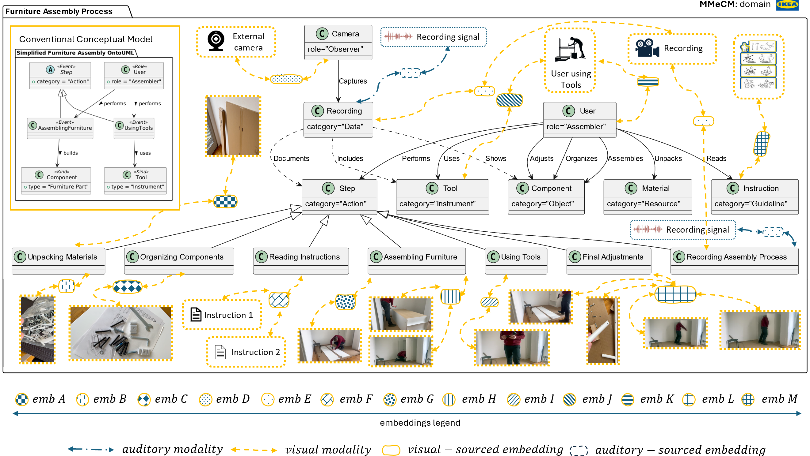

# Supplementary Material for "Towards the Enrichment of Conceptual Models with Multimodal Data"




This repository contains the supplementary code and datasets accompanying the paper **"Towards the Enrichment of Conceptual Models with Multimodal Data"**.

## Table of Contents

- [Folder Structure](#folder-structure)
- [Prerequisites](#prerequisites)
- [Automated Repository Setup](#automated-repository-setup)
- [Installation](#installation)
- [Execution Order](#execution-order)
- [Datasets and Similarity Matrices](#datasets-and-similarity-matrices)
- [Survey Interface](#survey-interface)
- [Assets](#assets)
- [Citation](#citation)
- [License](#license)

## Folder Structure

```
.
├── README.md
├── implementation
│   ├── ontouml_merge_all_ontologies.py
│   ├── ontouml_filter_ontologies.py
│   ├── ontouml_ectract_name_values.py
│   ├── ontouml_concat_names.py
│   ├── ontouml_prompt_llm.py
│   ├── ontouml_make_embeddings.py
│   ├── imagebind
│   │   └── get_imagebind.sh
│   └── ontouml
│       └── get_ontouml_models.sh
├── Multimodal-Enriched_dataset_OntoUML_Catalogue
│   ├── name_embeddings_0.json
│   ├── name_embeddings_1.json
│   ├── ...
│   └── name_embeddings_15.json
├── similarity_matrices
│   ├── text_softmax_scores_0.csv
│   ├── text_softmax_scores_1.csv
│   ├── ...
│   └── text_softmax_scores_14.csv
├── survey
│   └── [Survey Interface Files]
└── assets
    ├── figures
    │   └── [Full resolution figures from the paper]
    └── [aux data]
```

## Prerequisites
Before executing the provided MMeCM scripts, ensure that you have set up the following repositories: [ImageBind](https://github.com/facebookresearch/ImageBind) and [OntoUML Catalogue](https://github.com/OntoUML/ontouml-models). Proced to see the manual repository setup or jump to [Automated Repository Setup (Linux)](#automated-repository-setup).

### Manual Repository Setup

1. **ImageBind Repository**  
   Clone the [ImageBind repository](https://github.com/facebookresearch/ImageBind) and install it by running:
   ```bash
   pip install .
   ```
   This repository provides a `setup.py` file that will download the necessary model checkpoint (`image_bind_huge.pth`), which should be located in the `.checkpoint` folder.
   ```bash
   python setup.py
   ```

2. **OntoUML/UFO Catalogue Repository**  
   Clone the [OntoUML Catalogue repository](https://github.com/OntoUML/ontouml-models) to obtain the ontology models required for the experiments.

### Automated Repository Setup (Linux)

To simplify the setup process, two automated bash scripts have been provided:

- **ImageBind Setup Script**  
  Located at `implementation/imagebind/get_imagebind.sh`, this script will:
  - Clone the ImageBind repository into an `ImageBind` directory.
  - Change into the cloned directory.
  - Install the package via `pip install .`.
  - Run the setup script with `python setup.py` to download the necessary model checkpoint.

  **Usage:**
  ```bash
  cd implementation/imagebind
  chmod +x get_imagebind.sh    # Ensure the script is executable
  ./get_imagebind.sh
  ```

- **OntoUML Models Setup Script**  
  Located at `implementation/ontouml/get_ontouml_models.sh`, this script will:
  - Clone the OntoUML Catalogue repository into an `ontouml-models` directory.

  **Usage:**
  ```bash
  cd implementation/ontouml
  chmod +x get_ontouml_models.sh    # Ensure the script is executable
  ./get_ontouml_models.sh
  ```

## Installation

1. **Clone this Repository**  
   Clone the supplementary material repository:
   ```bash
   git clone https://github.com/aleksandargavric/mm_cm_enrichment
   cd mm_cm_enrichment
   ```

2. **Run Automated Setup Scripts**  
   To set up the required repositories, run the provided scripts:
   - For ImageBind:
     ```bash
     cd implementation/imagebind
     ./get_imagebind.sh
     ```
   - For OntoUML Catalogue:
     ```bash
     cd ../ontouml
     ./get_ontouml_models.sh
     ```

3. **Verify Prerequisites**  
   Ensure that both the ImageBind and OntoUML Catalogue repositories have been cloned and installed as described above.


## Execution Order

The main implementation scripts are located in the `implementation` folder and should be executed in the following order:

1. **Merge Ontologies:**  
   Run the script to merge all ontology data.
   ```bash
   python implementation/ontouml_merge_all_ontologies.py
   ```

2. **Filter Ontologies:**  
   Filter the merged ontologies.
   ```bash
   python implementation/ontouml_filter_ontologies.py
   ```

3. **Extract Name Values:**  
   Extract the necessary name values from the ontologies.
   ```bash
   python implementation/ontouml_extract_name_values.py
   ```

4. **Concatenate Names:**  
   Concatenate the extracted names.
   ```bash
   python implementation/ontouml_concat_names.py
   ```

5. **Prompt LLM:**  
   Execute the script to generate prompts for the language model.
   ```bash
   python implementation/ontouml_prompt_llm.py
   ```

6. **Generate Embeddings:**  
   Finally, generate the embeddings using the provided data.
   ```bash
   python implementation/ontouml_make_embeddings.py
   ```

## Datasets and Similarity Matrices

- **Multimodal-Enriched Dataset:**  
  The folder `Multimodal-Enriched_dataset_OntoUML_Catalogue` contains 15 JSON files (`name_embeddings_0.json` to `name_embeddings_15.json`) representing the enriched name embeddings.

- **Similarity Matrices:**  
  The similarity matrices are provided as CSV files in the `similarity_matrices` folder (from `text_softmax_scores_0.csv` to `text_softmax_scores_14.csv`).

## Survey Interface

The survey interface is available in the `survey` folder. This interface is designed to collect user feedback regarding the enriched conceptual models and the multimodal integration process.

## Assets

- **Figures:**  
  The `assets/figures` folder contains full resolution figures from the paper.


## License

This supplementary material is provided under the [`assets/LICENSE.md`](assets/license.md) License. See the LICENSE file for further details.

### Third-Party Licenses

This project makes use of the following third-party repositories. Their licensing terms are provided by their respective maintainers:

#### ImageBind Repository
- **Repository:** [Facebook Research/ImageBind](https://github.com/facebookresearch/ImageBind)
- **License:** Please refer to the LICENSE file within the cloned ImageBind repository for complete details.

#### OntoUML Models Repository
- **Repository:** [OntoUML/ontouml-models](https://github.com/OntoUML/ontouml-models)
- **License:** Please refer to the LICENSE file within the cloned OntoUML models repository for complete details.
